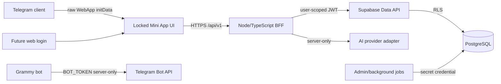
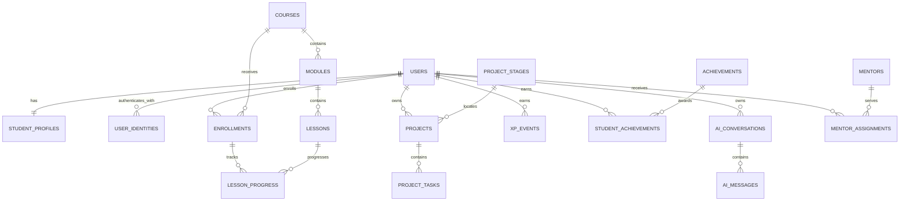

# Phase 2 — Student App production architecture

Status: proposal only. No backend, database, frontend integration, deployment, or paid AI provider is implemented in this phase.

Baseline: `905cae22c5b8da0618fd9f00b412c3c26e4e042c`

## 1. Decisions

- Keep the approved Vite Mini App and its five routes. Later work replaces hard-coded data through a thin API/data adapter; it does not redesign the UI.
- Use Supabase for managed PostgreSQL, migrations, backups, the Data API, and Row Level Security (RLS).
- Add a small Node.js/TypeScript Backend-for-Frontend (BFF), preferably Fastify, under `server/` in a later phase. It owns authentication, domain commands, AI orchestration, rate limits, and response shaping.
- Keep the Grammy bot as a separate process or migrate it to a webhook later. It shares server configuration, but it is not the student API.
- The browser calls versioned BFF endpoints. The BFF calls Supabase with the student's short-lived JWT so database RLS still applies. Service/secret credentials are reserved for migrations, seed jobs, and narrowly scoped background work.
- Use UUIDs as internal identifiers. Telegram IDs are external identity subjects and never become primary keys.
- Store canonical data in normalized tables. Screen-specific progress, locked states, totals, and summaries are derived by queries or transactional database functions.
- No public student profiles, discovery, leaderboards, or student-to-student messaging.

## 2. System shape



Recommended deployment boundary:

- Serve the frontend and `/api` from the same site where practical.
- Keep the access token in memory. Put the rotating refresh token in a `Secure`, `HttpOnly`, `SameSite=Lax`, `Path=/` cookie.
- Keep `BOT_TOKEN`, the JWT signing private key, Supabase secret/service credentials, database credentials, and AI keys in the server secret store only.
- A Supabase publishable key is safe to expose if direct client access is introduced later, but it is not a substitute for RLS.

## 3. Authentication and identity

### Telegram sign-in

1. The Mini App sends the exact `Telegram.WebApp.initData` string to `POST /api/v1/auth/telegram` over HTTPS.
2. The server parses the query string and rejects missing or malformed `hash`, `auth_date`, or `user` fields.
3. The server builds the alphabetically sorted data-check string and validates its HMAC-SHA-256 using `BOT_TOKEN`. Comparison is constant-time.
4. The server enforces a short freshness window (recommended: five minutes), rejects timestamps too far in the future, and rate-limits by Telegram subject and network signal.
5. Only after validation does the server parse the `user` JSON. It looks up `user_identities(provider = 'telegram', provider_subject = telegram_user_id_as_text)`.
6. In one transaction, the server creates an internal `users` row and `student_profiles` row when this is the first login, or updates only explicitly allowed display fields when the profile has not been customized.
7. The server creates a revocable session, returns a short-lived access JWT (recommended: 10–15 minutes), and sets a rotating opaque refresh-token cookie. Only a hash of the refresh token is stored.
8. The frontend replaces any optimistic `initDataUnsafe` display value with the authenticated `/bootstrap` response. `initDataUnsafe` is never an authentication or authorization source.

Raw `initData`, bot tokens, access tokens, and refresh tokens are never stored in analytics or ordinary application logs.

### Token and RLS identity

Import an asymmetric ES256 signing key into Supabase. The BFF holds the private key and mints user access tokens accepted by the Supabase Data API. Minimum claims:

```json
{
  "sub": "internal-user-uuid",
  "role": "authenticated",
  "aud": "authenticated",
  "app_user_id": "internal-user-uuid",
  "auth_provider": "telegram",
  "session_id": "session-uuid",
  "iat": 0,
  "exp": 0
}
```

RLS uses `app_user_id`, not a Telegram ID:

```sql
create schema if not exists app_private;

create function app_private.current_user_id()
returns uuid
language sql
stable
set search_path = ''
as $$
  select nullif((select auth.jwt()) ->> 'app_user_id', '')::uuid
$$;
```

Grant only `USAGE` on `app_private` and `EXECUTE` on this function to `authenticated`. Do not expose the schema through the Data API.

### Future normal web login

`user_identities` decouples application users from authentication providers. A future Supabase Auth email/passkey or approved OAuth login creates or links a row with `provider = 'supabase_auth'` and the Auth user UUID as `provider_subject`. A Supabase Custom Access Token Hook adds the same canonical `app_user_id` claim. Telegram and web sessions then resolve to the same `users.id` and reuse every RLS policy.

Account linking must require proof of both identities; matching a display name, Telegram username, or email string is never sufficient.

## 4. Data model

Use `uuid` primary keys with `gen_random_uuid()`, `timestamptz` timestamps, explicit foreign keys, and `text` status columns with `CHECK` constraints. Avoid PostgreSQL enums initially because workflow states will evolve.

### Identity and private profile

#### `users`

- `id uuid primary key`
- `kind text not null default 'student' check (kind in ('student','mentor','admin'))`
- `status text not null default 'active' check (status in ('active','suspended','deleted'))`
- `created_at`, `updated_at`, `last_seen_at timestamptz`
- `deleted_at timestamptz null`

No Telegram ID, email, date of birth, school, address, or phone belongs here.

#### `user_identities` — necessary provider-neutral account mapping

- `id uuid primary key`
- `user_id uuid not null references users(id) on delete cascade`
- `provider text not null check (provider in ('telegram','supabase_auth'))`
- `provider_subject text not null`
- `created_at`, `last_authenticated_at timestamptz`
- `unique (provider, provider_subject)`
- `unique (user_id, provider)` for the first release

Store Telegram IDs as text to avoid client-language numeric coercion. Do not store raw Telegram payloads, usernames, or photo URLs unless a reviewed product requirement appears.

#### `student_profiles`

- `user_id uuid primary key references users(id) on delete cascade`
- `display_name text not null check (char_length(display_name) between 1 and 60)`
- `locale text not null default 'uk'`
- `timezone text null`
- `current_streak integer not null default 0 check (current_streak >= 0)`
- `longest_streak integer not null default 0 check (longest_streak >= current_streak)`
- `last_activity_on date null`
- `level_id uuid null references levels(id)` as a cache; XP remains authoritative
- `onboarding_completed_at`, `updated_at timestamptz`

Do not collect exact age or birth date for the initial product. If age gating later becomes legally necessary, prefer a coarse reviewed age band over a birth date.

#### `auth_sessions` — server-private schema

- `id uuid primary key`
- `user_id uuid not null references users(id) on delete cascade`
- `provider text not null`
- `refresh_token_hash text not null unique`
- `created_at`, `last_used_at`, `expires_at timestamptz not null`
- `revoked_at timestamptz null`
- optional coarse device label; no raw init data or unnecessary fingerprinting

### Learning content and progress

#### `courses`

- `id uuid primary key`, `slug text unique not null`
- `title`, `description text not null`
- `status text check (status in ('draft','published','archived'))`
- `version integer not null default 1 check (version > 0)`
- timestamps

#### `modules`

- `id uuid primary key`
- `course_id uuid not null references courses(id) on delete restrict`
- `position integer not null check (position > 0)`
- `title`, `description text not null`
- `status text check (status in ('draft','published','archived'))`
- `unique (course_id, position)`

#### `lessons`

- `id uuid primary key`
- `module_id uuid not null references modules(id) on delete restrict`
- `position integer not null check (position > 0)`
- `slug`, `title`, `summary text not null`
- `content jsonb not null default '{}'` for versioned lesson blocks, validated at the API boundary
- `estimated_minutes integer check (estimated_minutes > 0)`
- `xp_reward integer not null default 0 check (xp_reward >= 0)`
- `prerequisite_lesson_id uuid null references lessons(id)`
- `status text check (status in ('draft','published','archived'))`
- `unique (module_id, position)`, `unique (module_id, slug)`

#### `enrollments`

- `id uuid primary key`
- `user_id uuid not null references users(id) on delete cascade`
- `course_id uuid not null references courses(id) on delete restrict`
- `status text check (status in ('active','completed','paused'))`
- `current_lesson_id uuid null references lessons(id)`
- `started_at`, `completed_at`, `last_activity_at timestamptz`
- `unique (user_id, course_id)`

#### `lesson_progress`

- `id uuid primary key`
- `enrollment_id uuid not null references enrollments(id) on delete cascade`
- `lesson_id uuid not null references lessons(id) on delete restrict`
- `status text check (status in ('not_started','in_progress','completed'))`
- `progress_percent smallint not null default 0 check (progress_percent between 0 and 100)`
- `started_at`, `completed_at`, `last_activity_at timestamptz`
- `unique (enrollment_id, lesson_id)`
- completion constraint: completed rows have `progress_percent = 100` and `completed_at is not null`

Locked/current/completed UI states are derived from publication state, prerequisites, enrollment, and progress. They are not independently editable flags.

### Projects and the Startup Lab

#### `project_stages` — necessary shared stage definition

- `id uuid primary key`, `code text unique not null`
- `title text not null`, `position integer unique not null check (position > 0)`
- `default_completion_percent smallint check (default_completion_percent between 0 and 100)`
- `is_active boolean not null default true`

#### `projects`

- `id uuid primary key`
- `user_id uuid not null references users(id) on delete cascade`
- `enrollment_id uuid null references enrollments(id) on delete set null`
- `title text not null check (char_length(title) between 1 and 120)`
- `summary text not null default '' check (char_length(summary) <= 1000)`
- `stage_id uuid not null references project_stages(id)`
- `status text check (status in ('active','completed','archived'))`
- `completion_percent smallint not null default 0 check (completion_percent between 0 and 100)`
- `workspace_url text null`
- timestamps
- partial unique index allowing at most one active project per user/course enrollment for the first release

#### `project_tasks`

- `id uuid primary key`
- `project_id uuid not null references projects(id) on delete cascade`
- `stage_id uuid null references project_stages(id)`
- `position integer not null check (position > 0)`
- `title text not null`, `description text not null default ''`
- `status text check (status in ('locked','available','in_progress','completed'))`
- `xp_reward integer not null default 0 check (xp_reward >= 0)`
- `completed_at timestamptz null`
- `unique (project_id, position)`

Project completion and stage transitions are server-controlled domain commands, not unrestricted row updates.

### XP, levels, and artifacts

#### `levels`

- `id uuid primary key`, `code text unique not null`, `title text not null`
- `position integer unique not null`, `min_xp integer unique not null check (min_xp >= 0)`

#### `xp_events` — append-only ledger

- `id uuid primary key`
- `user_id uuid not null references users(id) on delete cascade`
- `delta integer not null check (delta <> 0)`
- `event_type text not null`
- `source_type text null`, `source_id uuid null`
- `idempotency_key text not null unique`
- `description text not null default ''`
- `created_at timestamptz not null default now()`

XP totals are the sum of this ledger. `idempotency_key` prevents duplicate rewards when requests retry.

#### `achievements`

- `id uuid primary key`, `code text unique not null`
- `title`, `description text not null`
- `artifact_style_key text not null`
- `xp_reward integer not null default 0 check (xp_reward >= 0)`
- `criteria jsonb not null default '{}'`
- `is_published boolean not null default false`

#### `student_achievements`

- `user_id uuid not null references users(id) on delete cascade`
- `achievement_id uuid not null references achievements(id) on delete restrict`
- `xp_event_id uuid null unique references xp_events(id)`
- `awarded_at timestamptz not null default now()`
- `primary key (user_id, achievement_id)`

### Mentor information

#### `mentors`

- `id uuid primary key`
- `user_id uuid null unique references users(id) on delete set null`
- curated `display_name`, `title`, `avatar_path` fields only
- `is_active boolean not null default true`

#### `mentor_assignments`

- `id uuid primary key`
- `student_user_id uuid not null references users(id) on delete cascade`
- `mentor_id uuid not null references mentors(id) on delete restrict`
- `starts_at timestamptz not null`, `ends_at timestamptz null`
- `next_meeting_at timestamptz null`
- partial unique index for one active mentor assignment per student

Students can see only their assignment and the assigned mentor's curated fields. Mentor contact details are not exposed.

### AI mentor

#### `ai_conversations`

- `id uuid primary key`
- `user_id uuid not null references users(id) on delete cascade`
- nullable `course_id`, `lesson_id`, `project_id` foreign keys for the selected context
- `title text not null default 'Нова розмова'`
- `status text check (status in ('active','archived'))`
- `created_at`, `updated_at`, `last_message_at timestamptz`

#### `ai_messages`

- `id uuid primary key`
- `conversation_id uuid not null references ai_conversations(id) on delete cascade`
- `role text not null check (role in ('user','assistant'))`
- `content text not null check (char_length(content) between 1 and 20000)`
- `client_message_id uuid null` with unique `(conversation_id, client_message_id)` for retry safety
- `safety_status text check (safety_status in ('pending','allowed','blocked','review'))`
- `created_at timestamptz not null default now()`

System prompts, tool payloads, API keys, and hidden reasoning are never stored in student-readable message rows.

#### `ai_conversation_state` — server-private schema

- `conversation_id uuid primary key references ai_conversations(id) on delete cascade`
- `summary text not null default ''`
- `prompt_version text not null`
- `last_compacted_message_id uuid null`
- provider usage and safety metadata needed for operations, with a documented retention period

### Relationship summary



Create indexes for every foreign key used by RLS and for these common paths:

- `enrollments(user_id, status)`
- `lesson_progress(enrollment_id, status)`
- `projects(user_id, status)`
- `project_tasks(project_id, position)`
- `xp_events(user_id, created_at desc)`
- `student_achievements(user_id, awarded_at desc)`
- `ai_conversations(user_id, last_message_at desc)`
- `ai_messages(conversation_id, created_at, id)`

## 5. RLS and authorization model

Enable RLS explicitly on every exposed table. Revoke default grants and grant only the operations each role needs. `anon` receives no student-data privileges.

| Table | Student read | Student direct write | Server/admin write |
|---|---|---|---|
| `users` | own row | none | yes |
| `student_profiles` | own row | safe-fields RPC only | yes |
| `courses`, `modules`, `lessons`, `levels`, `project_stages`, `achievements` | published/active content | none | yes |
| `enrollments` | own rows | none | yes |
| `lesson_progress` | rows through own enrollment | validated progress RPC | yes |
| `projects` | own rows | validated project RPCs | yes |
| `project_tasks` | tasks through own project | validated task RPC | yes |
| `xp_events` | own rows | none | yes, append-only |
| `student_achievements` | own rows | none | yes |
| `mentor_assignments`, `mentors` | active assignment and curated assigned mentor | none | yes |
| `ai_conversations` | own rows | API/RPC only | yes |
| `ai_messages` | messages through own conversation | API/RPC only | yes |
| private-schema tables | none | none | server only |

Representative ownership policies:

```sql
-- Direct owner
using (user_id = (select app_private.current_user_id()))

-- Indirect owner: project task
using (exists (
  select 1 from public.projects p
  where p.id = project_tasks.project_id
    and p.user_id = (select app_private.current_user_id())
))

-- Indirect owner: AI message
using (exists (
  select 1 from public.ai_conversations c
  where c.id = ai_messages.conversation_id
    and c.user_id = (select app_private.current_user_id())
))
```

Rules:

- Add explicit owner filters in API queries as well as RLS; RLS is the security boundary, not the query planner.
- Students cannot directly award XP, unlock achievements, complete arbitrary tasks, or change ownership fields.
- Implement domain changes such as `complete_lesson`, `complete_project_task`, and `update_own_profile` as narrow transactional functions. If `SECURITY DEFINER` is required, set an empty `search_path`, schema-qualify every object, validate ownership inside the function, and revoke default `EXECUTE` grants.
- Never use a service/secret client for an ordinary student request. Those credentials bypass RLS.
- Views exposed to students must use `security_invoker = true` so underlying RLS applies.
- Add automated policy tests for two students, anonymous access, cross-user identifiers, missing claims, and admin/background paths before integrating the frontend.

## 6. Student API contracts

Keep database column names out of the frontend contract. Return camelCase DTOs from `/api/v1`.

### Initial bootstrap

`GET /api/v1/student/bootstrap` returns one compact authenticated payload:

- viewer: internal ID, display name, level, total XP, streak
- active enrollment: course/module/current lesson and course progress
- current project summary: stage, completion, next task
- project count and artifact count
- assigned mentor summary
- active AI conversation ID and context labels when one exists

This replaces the current hard-coded Home and shared header/profile values in one request.

### Screen-specific reads and commands

| Existing screen | API | Primary sources |
|---|---|---|
| Home | `GET /student/bootstrap` | profile, enrollment/progress aggregates, XP ledger, projects |
| Learning | `GET /learning`, `POST /lessons/:id/progress` | courses, modules, lessons, enrollments, lesson progress |
| Project | `GET /projects/current`, `POST /project-tasks/:id/complete` | projects, stages, tasks, transactional XP award |
| AI | `GET /ai/conversations/:id/messages?cursor=`, `POST /ai/conversations/:id/messages` | own conversation/messages plus server-built context |
| Profile | `GET /profile`, `PATCH /profile`, `GET /achievements` | profile, XP/level aggregate, artifacts, mentor assignment |

Use cursor pagination for AI history and XP history. Mutation requests use client-generated idempotency keys. The workspace URL is returned only for the owning student's project and should be an authorized or short-lived link if the workspace later contains private data.

The eventual frontend integration should introduce a small API client and state object, then feed the existing template functions. Loading, empty, and error states must reuse the locked visual system.

## 7. AI mentor context architecture

The AI route calls only the BFF. The browser never receives an AI key or a system prompt.

For each message, the server:

1. Authenticates the session and verifies conversation ownership through RLS.
2. Applies rate and size limits, validates a client message ID, and runs age-appropriate input safety checks.
3. Stores the user's message once.
4. Builds a minimal context package from:
   - display name and locale;
   - active course, module, current lesson, objectives, and progress;
   - own current project, stage, next incomplete task, and completion percentage;
   - private conversation summary and a bounded recent-message window;
   - only relevant published lesson content.
5. Applies a versioned server-side mentor prompt: guide thinking, explain clearly, do not complete the project for the student, acknowledge uncertainty, and escalate unsafe or high-risk topics appropriately.
6. Calls an `AiProvider` interface. Phase 2 can use a deterministic mock provider; a paid provider is a later configuration change.
7. Runs output safety checks, stores the assistant response, and updates the private summary asynchronously when needed.

Never include Telegram IDs, usernames, raw auth data, tokens, other students' data, mentor private details, or unnecessary profile data in model context. Define retention and deletion rules for AI messages before production launch; default to the shortest history that meets the learning requirement.

## 8. Operational and privacy baseline

- Validate all request bodies and response DTOs with schemas.
- Use structured logs with request IDs and internal user IDs; redact authorization headers, cookies, init data, message content, and provider payloads by default.
- Rate-limit authentication, refresh, progress mutations, and AI messages separately.
- Record security-relevant events without recording children's conversation text in general logs.
- Back up PostgreSQL and test restoration. Run migrations through source control, never by ad hoc production dashboard edits.
- Use separate development, staging, and production Supabase projects and secrets.
- Define deletion/export procedures covering identity links, profile, progress, projects, and conversations.
- Do not add public profiles, peer search, direct messaging, precise location, exact birth date, school name, or phone number in this phase.

## 9. Small implementation phases

1. **Foundation:** approve this design; add TypeScript server scaffolding, environment validation, Supabase CLI structure, migrations, and local test tooling. No frontend integration.
2. **Identity:** implement Telegram validation tests, `users`, `user_identities`, `student_profiles`, sessions, access/refresh tokens, logout, and the future-web-login claim contract.
3. **Schema and RLS:** create content/student migrations, seed the current prototype content, add policies/grants/indexes, and run cross-user isolation tests.
4. **Read path:** implement `/student/bootstrap` and screen read endpoints; add a frontend data adapter while leaving markup and styling unchanged.
5. **Learning and project commands:** implement idempotent progress/task transactions, XP ledger entries, stage updates, streaks, and artifact awards.
6. **AI persistence:** add conversations/messages, private context state, the mock `AiProvider`, safety/rate limits, and pagination. Do not connect a paid model yet.
7. **Production hardening:** observability, backup/restore drill, retention/deletion flows, load tests, security review, and only then staged deployment planning.

Each phase should ship with migrations, API contract tests, RLS isolation tests, and rollback notes before the next phase starts.

## 10. Decision references

- Telegram Mini Apps validation: https://core.telegram.org/bots/webapps#validating-data-received-via-the-mini-app
- Supabase Row Level Security: https://supabase.com/docs/guides/database/postgres/row-level-security
- Supabase API security and grants: https://supabase.com/docs/guides/api/securing-your-api
- Supabase custom/external JWTs: https://supabase.com/docs/guides/auth/jwts
- Supabase signing keys: https://supabase.com/docs/guides/auth/signing-keys
- Supabase custom access-token hook: https://supabase.com/docs/guides/auth/auth-hooks/custom-access-token-hook
